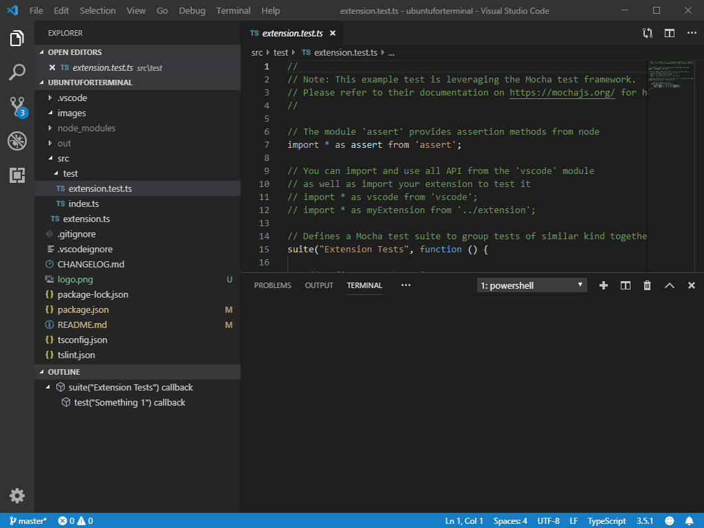

# Ubuntu For Terminal README

Ubuntu For Terminal takes the Ubuntu version of WSL and allows Visual Studio Code to use it as an integrated terminal.

## Features

### Shortcut
Ctrl+Alt+U  Open an Ubuntu terminal

### Command Example

## Requirements

### Install Ubuntu WSL
1. Open the Microsoft Store App
2. Search for "Ubuntu"
3. Get "Ubuntu" (NOT the ones with version numbers!)
4. Wait for the installation to finish
5. Go through Ubuntu first time setup to create the standard UNIX username and password

## Known Issues

None as far as I can tell. Please reach out to me on GitHub if you have any issues.

## Release Notes

### 0.0.1

Initial release of the extension

-----------------------------------------------------------------------------------------------------------

**Enjoy!**
